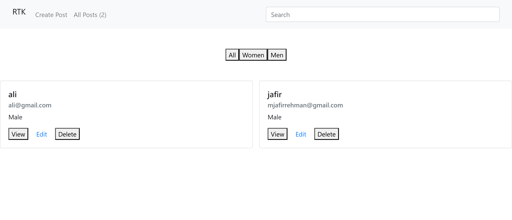
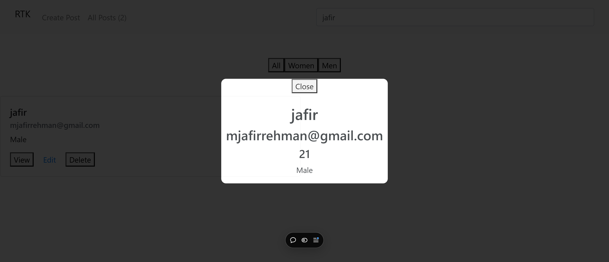

## 📝 Description

I build this project when i was learning react with redux toolkit. I use free api for adding user details, getting user details, updaing and deleting user details.

# Some Glimpse Of this project

### CREATE-USER-PAGE


### All-USERS-Page



### SEARCH-USER


### VIEW-USER



## 🛠️ Setup Project

To get this project up and running in your development environment, follow these step-by-step instructions.

### 🍴 Prerequisites

We need to install or make sure that these tools are pre-installed on your machine:

- [NodeJS](https://nodejs.org/en/download/): It is a JavaScript runtime build.

- [Git](https://git-scm.com/downloads): It is an open source version control system.

### 🚀 Install Project

1. Clone the Repository

```bash
git clone https://github.com/JafirRehman/react-redux-toolkit-CRUD.git
```

2. Install packages

```
npm install
```

4. Run the project using command below

```bash
npm run start
```

## Tech Stack

- React
- Redux-Toolkit
- Vercel for deployment
